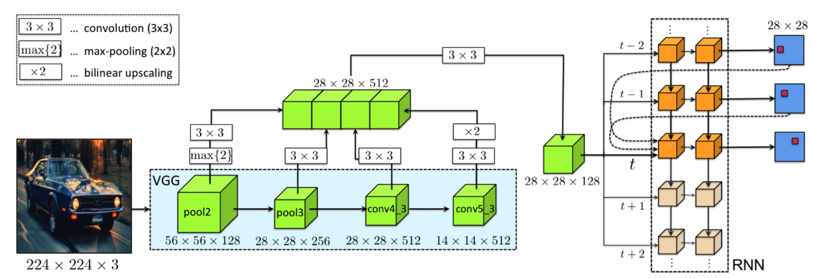
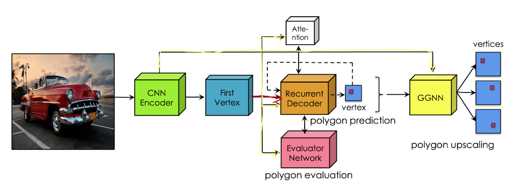
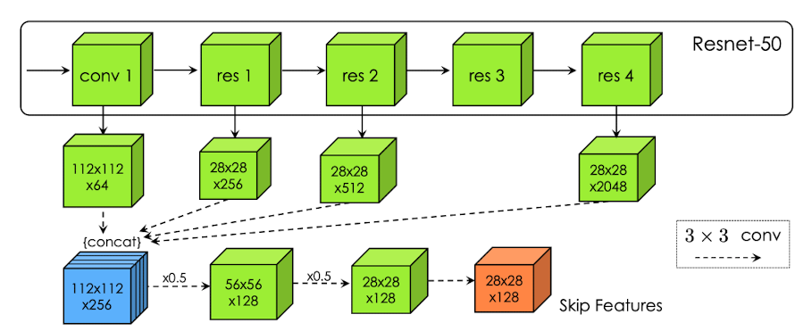
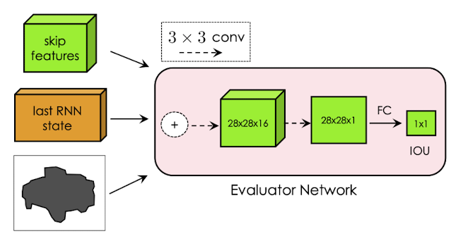
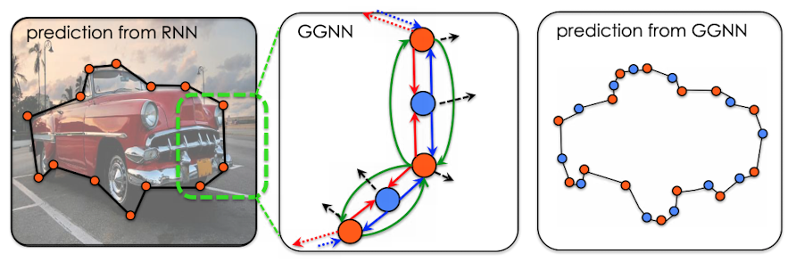
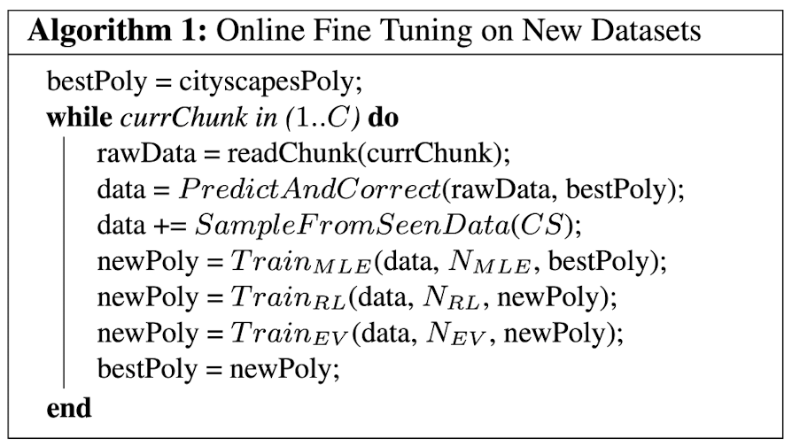

# 2019.11.1
## Annotating Object Instances with a Polygon-RNN
### 摘要
- 输入裁剪后的图像，输出该区域的物体边缘点
- 指标
    - 加速标注 4.7x

### 方法
- 假设实例分割的标注是一个闭环
- 起始点可以是任意一个点，闭环方向是顺时针
- 网络结构如下

- Encoder
    - 删除池化层，使得output stride == 4
    - 将各层feature map拼接起来，捕捉低级别细节信息和高级别语义信息
- Decoder
    - RNN的设计
        - 使用卷积LSTM，目的是减少计算量
        - two-layer LSTM with skip-connection from one and two times ago
        - K = (3, 3), C = 16
        - 预测方式是输出D x D + 1 的特征图，前面D x D表示一张图的one-hot编码，用于表示一个点的位置，后面那个 1 则是标识该点是否是最后一个点
        - 该RNN每次输入包括：Encoder得到的feature map，前面两次调用RNN得到的输出，第一次调用得到的输出
    - 预测第一个点的特殊处理
        - 增加两层卷积，第一层预测边缘信息，第二层以第一层的输出作为输入，预测第一点的位置
- Training
    - 训练RNN
        - 使用交叉熵
        - soft label
    - 训练预测第一个点的网络
        - 使用logistic loss
        - 多任务loss
- 半自动标注
    - 用户的输入会直接更新某一步的RNN输入
- 实现细节
    - 预处理消除不必要的边界点
    - 数据增强
        - random flip
        - 对输入的框随机扩展10%~20%
        - 随机选取第一个点
### 结果
- 数据集
    - Cityscapes dataset
    - KITTI

## Efficient Interactive Annotation of Segmentation Datasets with Polygon-RNN++
## 摘要
- 新的CNN Encoder
- 加入强化学习
- 加入图神经网络
### 方法
- 输入依然是一个框，但是这次固定取框扩展到15%的新框
- 整体结构依然是CNN + RNN
- 模型结构如下图

- 整体流程
    - CNN提取图像特征，用该图像特征预测第一个边界点，然后把这个边界点和图像特征一同作为RNN的输入，之后再用一个训练好的选择模型选取最合适的多边形，最后再用图神经网络完善这个多边形
- Encoder
    - ResNet-50
    - Dilation
    - Skip-layer architecture
- Decoder
    - ConvLSTM + Attention
    - two layers, 64 and 16 channels, k = (3, 3), use BN (unique mean/variance estimates across time steps)
    - attention机制
        - 输入是Encoder的输出和两层LSTM的hidden state tensors
    - 该Decoder还有一个额外的输入
        - 以上一个step的hidden state生成一个gated feature map，希望下一轮只关注特定区域
- Training
    - MLE training + RL training
    - RL training使用self-critical training with policy gradients
- Evaluator网络
    - 输入
        - Encoder得到的输出
        - RNN最后一个state tensor
        - 预测结果
    - 结构
        - 两层3 x 3卷积 + 一层全连接
    - 在RL training完成后单独训练
- Gated Graph Neural Network
    - 预测结果的顶点个数翻倍 + 用GGNN预测每个顶点的偏移量
    - 使用GRU
    - 对Encoder各级别的输入拼接结果，用一个 conv 15 x 15卷积后，针对每个顶点，选取该顶点在该feature map中对应位置及其周围一定区域的特征向量作为该模型的一次输入（实际操作中只选取一个位置的特征向量）
    - 与整个流程的联系
        - 获得CNN+RNN的预测结果，如果预测结果偏差较大，则进行修正

- 实现细节
    - 在训练的时候针对RNN的迭代，如果上一轮的输出与标签偏差较大，则用标签作为下一轮的输入
- Online Fine-Tuning算法

