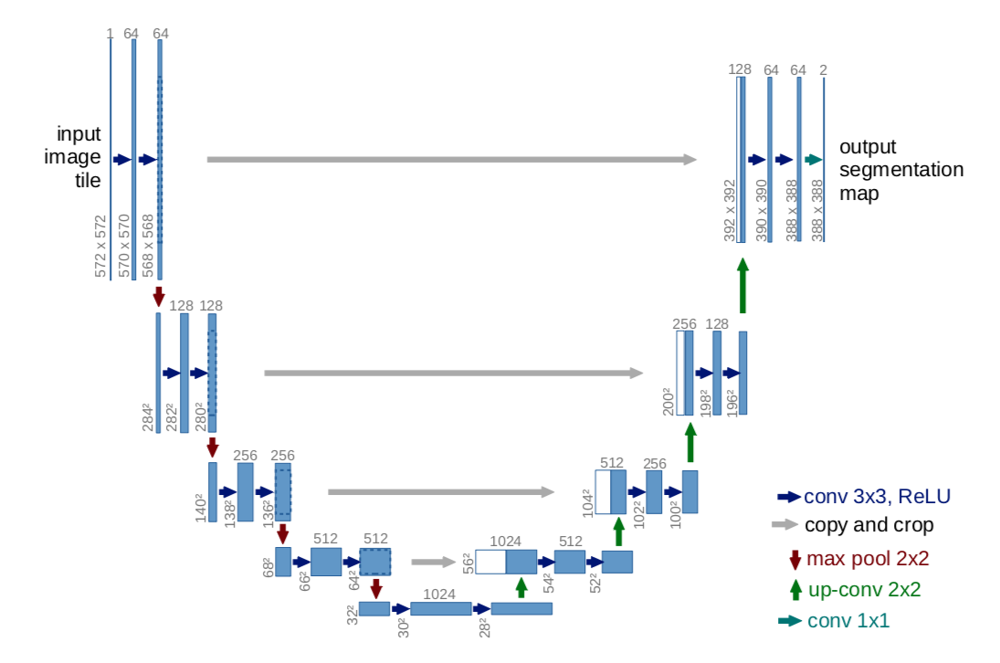
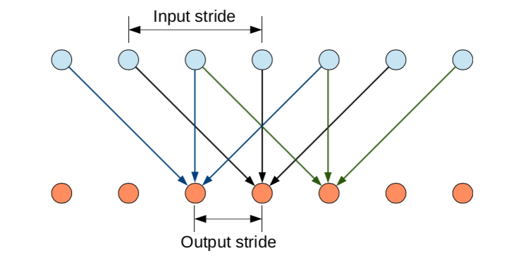
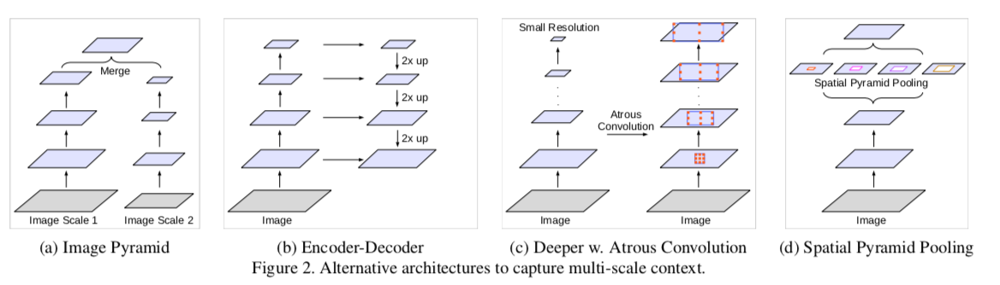
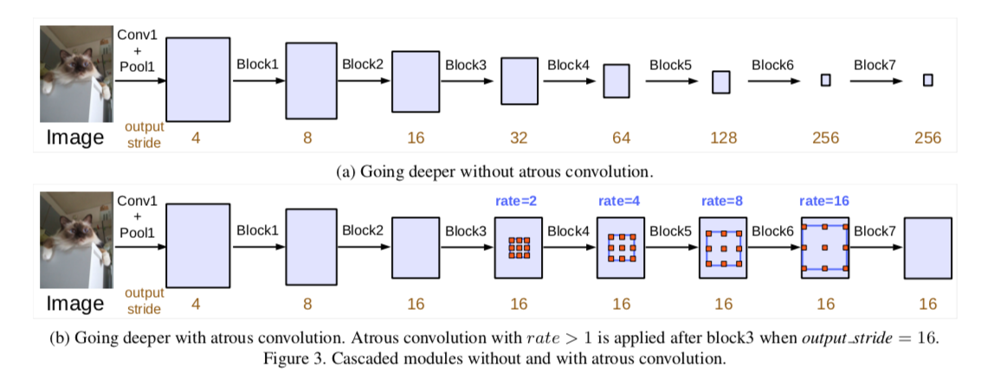
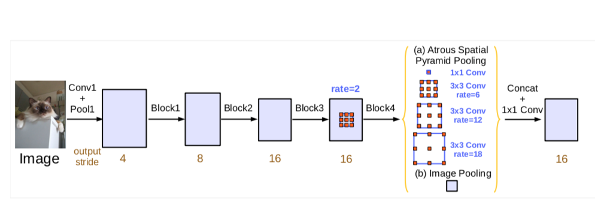
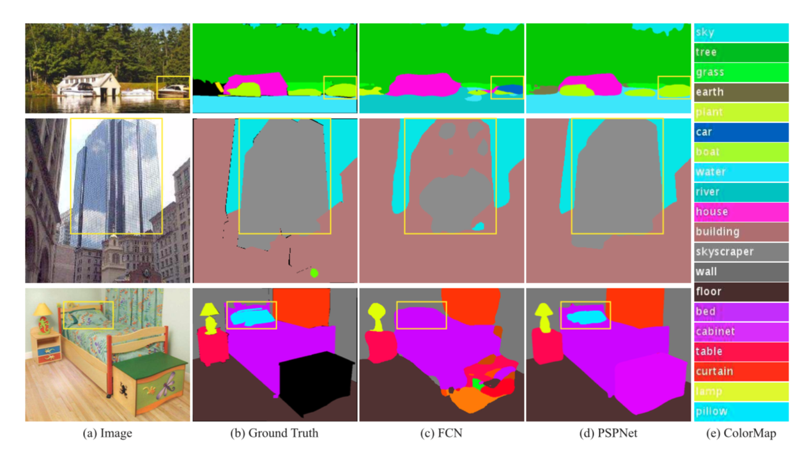
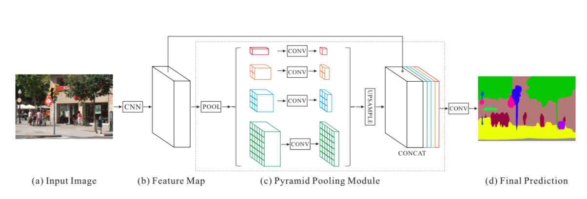
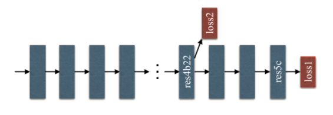
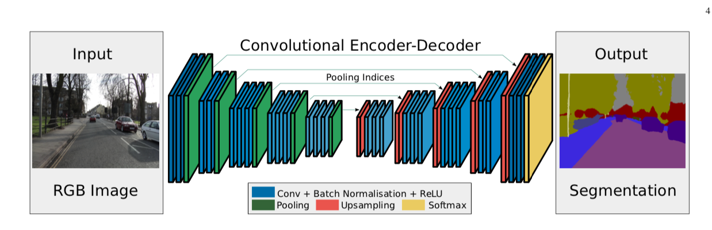

# 2019.9.21
## U-Net: Convolutional Networks for Biomedical Image Segmentation
### 网络结构

### Tricks
- 输入的图像在size上略有扩展（镜像方式）
- 为了表现更好的多细胞分割，训练时适当增加细胞边界背景的权重
- 数据增强
    - 平移
    - 旋转
    - 仿射变换
    - 灰度变换
    - 随机弹性形变
    - 网络中的dropout

### Dataset
- ISBI challenge

## Semantic Images Segmentation with Deep Convolutional Nets and Fully Connceted CRFs
### Abstract
- 使用CRF处理DCNN的输出，使得分割结果具备更加准确的局部边界
- PASCAL VOC-2012 IOU 71.6%

### Convolutional Neural Networks for Dense Image Labeling
- Efficient dense sliding window feature extraction with the hole algorithm
    - 将网络转换成全卷积模式
    - 空洞卷积
    - 只降采样到原图的1/8，然后双线性插值至原图大小

    

- Controlling the receptive field size and accelerating dense computation with convolutional nets
    - 减少第一个卷积的卷积核（从7x7 到 3x3）

### Detailed Boundary Recovery: Fully-Connected Conditional Random Fields and Multi-Scale Prediction
- Deep convolutional networks and the localiztion challenge
    - 分类准确率和分割精确性的权衡问题
    - 卷积网络只能给出大概的分割结果，但是并不能得出精细的分割边界
- Fully-connected conditional random fields for accurate localization

## Rethinking Atrous Convolution for Semantic Image Segmentation
### Abstract
- 使用空洞卷积
- 改进了空洞空间金字塔池化模块
- 舍弃了CRF
- 数据集依然是PASCAL VOC 2012

### Method
- Atrous Convolution for Dense Feature Extraction
    - 灵活控制卷积核的感受野大小
- Going Deeper with Atrous Convolution
    - 连续的降采样不利于分割
    - 本文采用 Multi-grid 方法，在后续卷积模块中引入空洞卷积

- Atrous Spatial Pyramid Pooling
    - 和先前DeepLab不同的是，这次引入了BN层
    - 随着rate的增大，有效卷积核个数逐渐减少，最后缩减为1个（中心）
    - 网络结构如下（如果stirde是8，则pooling当中的rate都要乘2）

## Pyramid Scene Parsing Network
### Abstract
- Pyramid pooling module
- PSPNet
- 数据集
    - ImageNet 2016
    - PASCAL VOC 2012
    - Cityscapes
### Introduction
- 贡献
    - 1.以FCN为基础，提出了PSPNet
    - 2.提出了针对ResNet的优化策略

### Pyramid Scene Parsing Network
- Important Observations
    - ADE20k数据集有150个标签，1038个场景
    - Mismatched Relationship
        - 需要提取上下文信息
    - Confusion Categories
        - （看起来像是数据集有问题）
    - Inconspicuous Classes
        - （例图给人一种吹毛求疵的感觉）

- 网络结构
    - backbone使用resnet
    - 采用扩张卷积策略提取feature map
    - 多层次Pooling
    - Pooling卷积，将channel数缩减为原先的 1/N, N为Pooling个数
    - 双线性插值上采样到原先的feature map大小
    - 几个上采样结果，加上pooling模块的输入，拼接后卷积输出结果
    - 目前的结构是 Pooling = {1, 2, 3, 6}

### Deep Supervision for ResNet-Based FCNs

### Experiments
- Implementation Details
    - 'poly' learning reate policy
    - Data augmentation
        - random mirror
        - random resize between 0.5 and 2
        - random rotation between -10 and 10 degrees
        - random Gaussian blur

- 实验结论
    - 使用average pooling
    - 深网络 => 好结果
    - 需要辅助loss

## SegNet: A Deep Convolutional Encoder-Decoder Architectur for Image Segmentation
### Abstract
- 关键点：上采样的方式是追溯之前下采样的模式，反着完成max pooling
- 目的：节省空间加快速度
- 数据集：CamVid, Pascal VOC12, SUN RGB-D

### Architecture

- 实现了N个Decoder
    - SegNet-Basic
    - FCN-Basic
    - Basic-SingleChannelDecoder
    - FCN-Basic-NoAddition
    - SegNet-Basic-EncoderAddition
    - FCN-Basic-NoDimReduction

### 实验发现
- 将编码器的特征映射全部存储，性能最佳。这在语义轮廓刻画度量(BF)中体现得最为明显。
- 当预测过程中的内存受到限制时，可以存储压缩形式的编码器特征映射(降维、最大池索引)，并与适当的解码器(如SegNet类型)一起使用，以提高性能。
- 较大的解码器可以提高给定编码器网络的性能。