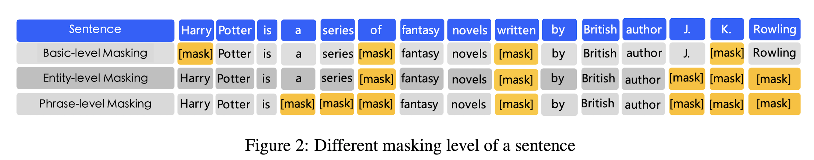
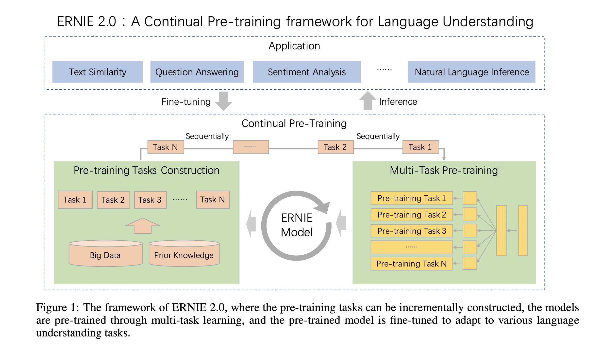

# 2020.2.28
## ERNIE: Enhanced Representation through Knowledge Integration
- Conclusion
    - Consider the prior knowledge in the sentence when implementing BERT.
- Maskink method
    - Knowledge masking
        - entity-level masking
            - "J.K.Rowling"
        - phrase-level masking
            - "a series of"
    - BERT masking 
        - a word

- Advantages
    - Learn the information about knowledge
    - Learn longer semantic dependency
        - relationship between entities
        - property of an entity
        - yype of an event
- Improvements
    - Better performence in Dialogue Language Model task
        - better score
        - can alse represent multi-turn conversations
    - Better performence in Cloze Test

## ERNIE2.0: A continual pre-training framework for language understanding
- Conclusion
    - Big data
    - Pretrain to extarct lexical, syntatic and semantic information

- Special point
    - Transfer Learning
        - pre-training and fine-tuning
        - During pre-training, each task has its own loss function.
        - After fine-tuning, each downstream task has its own fine-tuned models
    - Continual Learning
        - To train the model with several tasks in sequence to remembers the previously learned tasks when learning the new ones.
- Model Structure
    - Input Embedding
        - The corresponding token, segment, position and task embedding are taken as the input of the model.
- Pre-training tasks
    - word-aware pre-training
        - knowledge masking
            - in ERNIE 1.0
        - capitalization prediction
        - token-document relation
    - structure-aware pre-training
        - setence reordering
        - sentence distance
    - semantic-aware pre-training
        - discourse relation
        - IR relevance
            - about query and title
