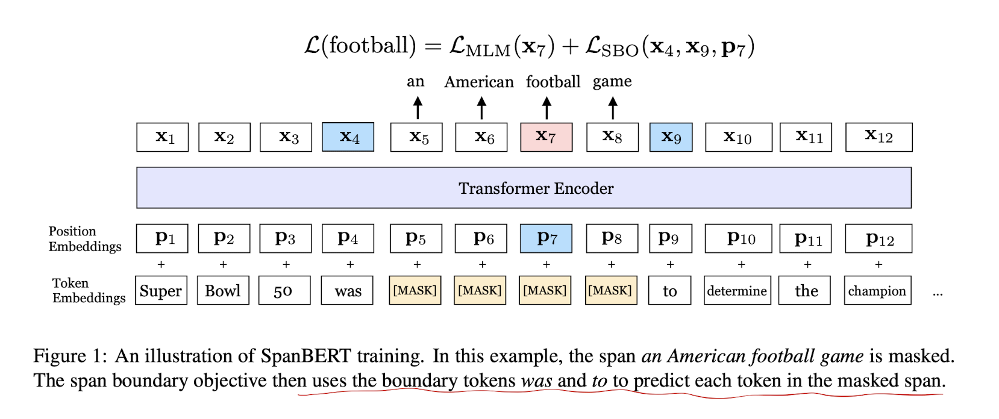

# 2020.3.6
## SpanBERT: Improving Pre-training by Representing and Predicting Spans
- Innovation points
    - Masking contiguous random spans, rather than random tokens
    - Training the span boundary representations to predict the entire content of the masked span
        - Span-boundary objective (SBO)
    - Remove Next Sentence Prediction(NSP) task
- Tasks
    - Span selections tasks
        - question answering
        - coreference resolution
- Benchmark
    - SQuAD 1.1, 2.0
    - OntoNotes coreference resolution task
    - TACRED relation extraction benchamrk
    - GLUE

## RoBERTa: A Robustly Optimizerd BERT Pretraining Approach
- code
    - https://github.com/pytorch/fairseq
- Innovation points
    - Training the model longer, with bigger batches, over more data
    - Removing the next sentence prediction(NSP) objective
    - Training on longer sequences
    - Dynamically changing the masking pattern applied to the training data
    - Collect a large new dataset: CC-NEWS
- Benchmark
    - GLUE
    - RACE
    - SQuAD
- Dataset
    - BOOKCORPUS
    - CCNEWS
    - Envlish WIKIPEDIA
    - OPEN WEB TEXT
    - STORIES
- Some details
    - Model Input Format and Next Sentence Prediction
        - segment-pair + NSP
            - A segment containes multiple natural sentences.
        - sentence-pair + NSP
            - Increase the batch size so that the total number of tokens remains similar to segment-pair + NSP.
        - full-sentences
            - Each input is packed with full sentences sampled contiguously from one or more documents. Inputs may cross document boundaries. NSP loss is removed.
        - doc-sentences
            - Inputs are construced similarly to full-sentences, except that they may not cross document boundaries.
        - Findings
            - Using individual sentences hurts performance on downstream tasks, which the authors hypothesize is because the model is not able to learn long-range dependencies.
            - Removing NSP loss matches or slightly improves downstream task performance.
            - Restricting sequences to come from a single document sperforms slightly better than packing sequences from multiple documents. However, the doc-sentences format results in variable batch sizes.
    - Text encoding
        - Byte-Pair Encoding(BPE) is a hybrid between character and word-leel representations taht allows handling the large vocabularies common in natural language corpora.
        - BPE achieves slightly worse end-task performance on some tasks. Nevertheless, they believe the advantages of a universal encoding scheme outweighs the minor degredation inperformance.