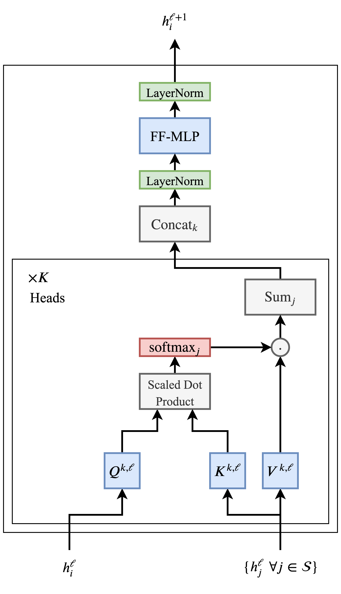
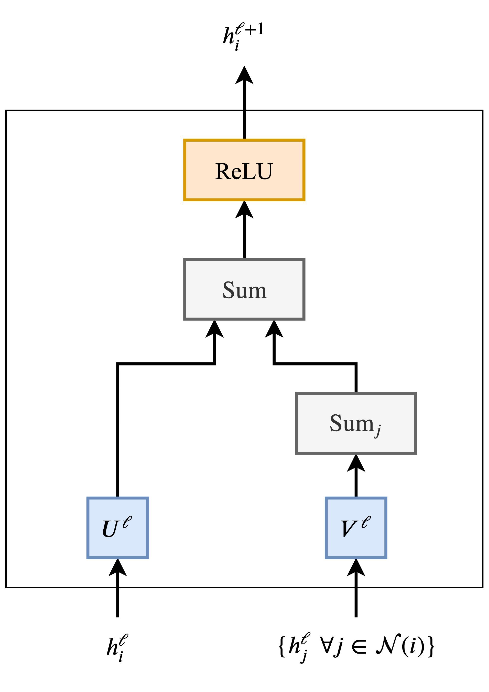
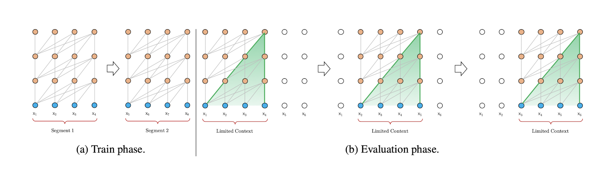
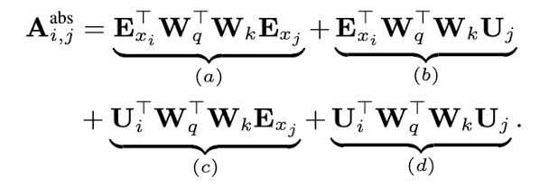
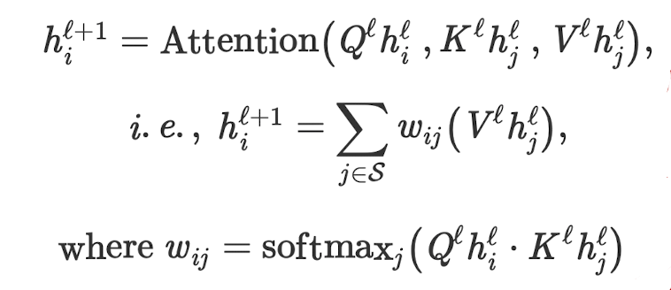
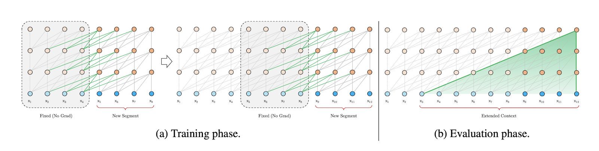
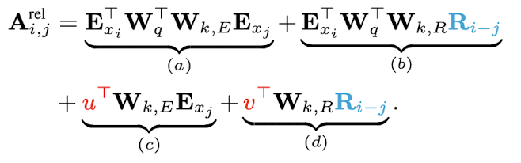
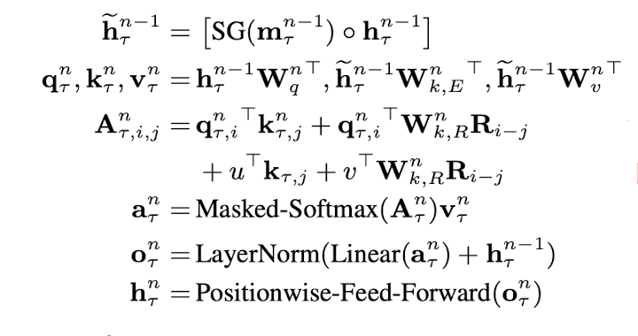

# 2020.3.13
## Transformers are Graph Neural Networks
- Graph Transformer
    - Graph Attention Network(GAT)
        - Do multiple parallel heads of neighbourhood aggregation
        - Replace summation over the neighbours with the attention mechanism
    - Add normalization, feed-forward MLP
- Transformation
    - Transformer
    

    - GNN
    

- Shinning points
    - Various problem-specific tricks - such as position encodings, casual/masked aggregation, learning rate schedules and extensive pre-training - are essential for the success of Transformers but seldom seem in the GNN community.
    - Looking at Transformers from a GNN perspective could inspire us to get rid of a lot of the bells and whistles in the architecture.

## Transformer-XL: Attentive Language Models Beyond a Fixed-Length Context
- Mechanisms
    - Segment-level recurrence
    - Novel positional encoding
- Dataset
    - enwiki8
    - text8
    - WikiText-103
    - One Billion Word
    - PennTreebank
- code
    - https://github.com/kimiyoung/transformer-xl
- Transformation
    - Vanilla
    
    
    

    - Transformer-XL
    
    
    
