

# 2019.8.10
## 1.Learning Transferable Architectures for Scalable Image Recognition
### Abstract
- 概括
  - 搜索模型代价昂贵，本文的策略是先在小数据集上学习building block，之后扩展到大数据集
- 核心贡献
  - NASNet 搜索空间
- 实验内容
  - CIFAR-10 dataset 中设计block，扩展到ImageNet 设计出 NASNet architecture
  - 引入正则化技术 ScheduleDropPath，提高泛化能力
    - 在CIFAR-10上达到 error_rate=2.4% (state of art)
    - 在ImageNet上accuracy: 82.7%(top-1) 96.2%(top-5), top-1的准确率比人工设计网络高1.2%
- 搜索出的模型特点
  - 计算量小的同时达到高泛化能力
    - 控制计算量的方法：1.控制Normal Block个数；2.控制初始filter个数
  - 可以迁移至其他任务：如分割检测
    - 在COCO检测数据集上，达到43.1%mAP，比第二名高4%

### Method
- 搜索方式

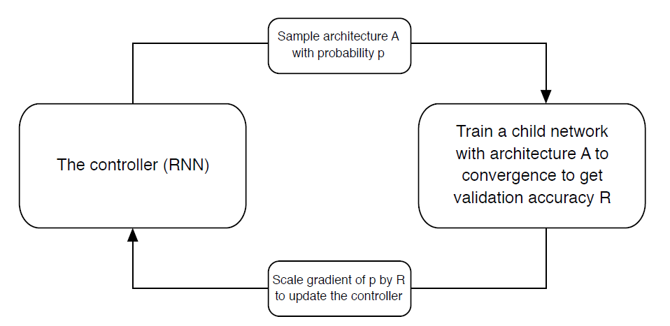

*这里的probability计算方式是softmax*

- 可扩展的理由
  - 人工设计的网络结构多为重复的motifs
  - 每个motif是一系列conv_layer nonlinear的拼接，加上一些额外的连接组成
- 网络结构的实现就是一系列convolutional cells的重复
- 两种convolutional cell(为了能扩展到multiscalar images)
  - Normal Cell
   - Reduction Cell (Stride=2)
      - Trick: Double the number of filters whenever the spatial activation size is reduced in order to **maintain roughly constant hidden state dimension**
- 搜索细节
  - 强化学习的搜索方式
  - 随机搜索方式

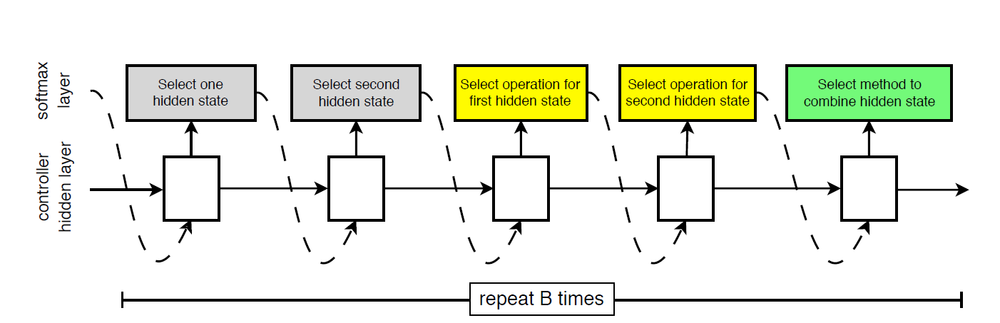

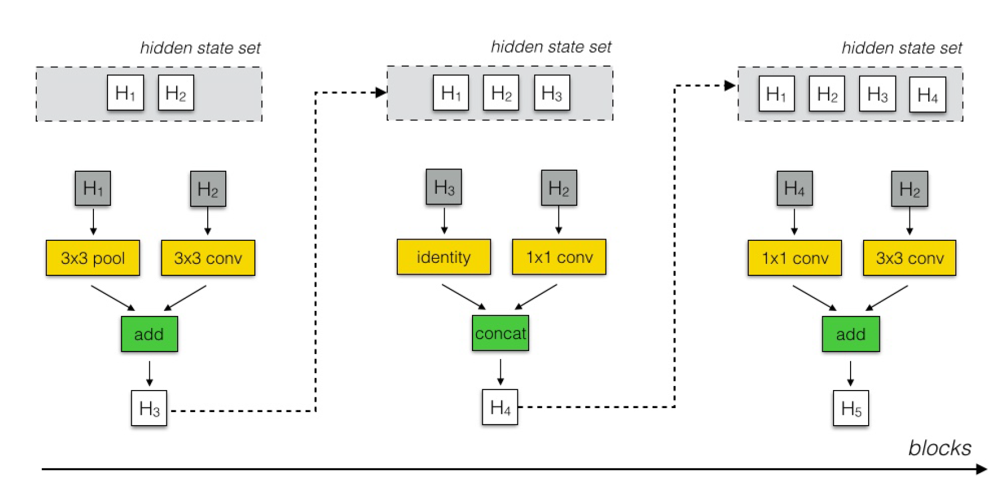

### Experiments
- Controlled RNN训练方式
  - Proximal Plicy Optimization
- ScheduleDropPath
  - 在一个cell中，每个通路都按照一定概率关闭，该概率随着训练轮次增加增大
- CIFAR-10
  - 运行五轮计算平均误差为2.40%（最好一次是2.19%），之前的记录是2.56%
  - 使用了cutout data augmentation涨点
- ImageNet
  - 更少的计算量达到更好的准确率
  - 自行学习残差
- Object detection
  - 对比mobile-optimized网络：29.6% vs 24.5% (mAP at mini-val)
  - 对比其他网络：mini-val 43.2% vs 41.3%; test-dev 43.1% vs 40.7%
- RS和RL的对比
  - RS是brute-force random search
  - RL最佳模型比RS最佳模型好1%
  - RL找到的模型普遍比RS找到的好

### 补充
- mAP的计算方法

## 2.Deformable Convolutional Networks
### Method

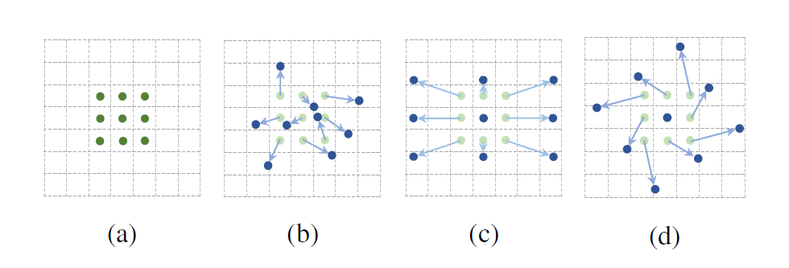

- deformable convolution

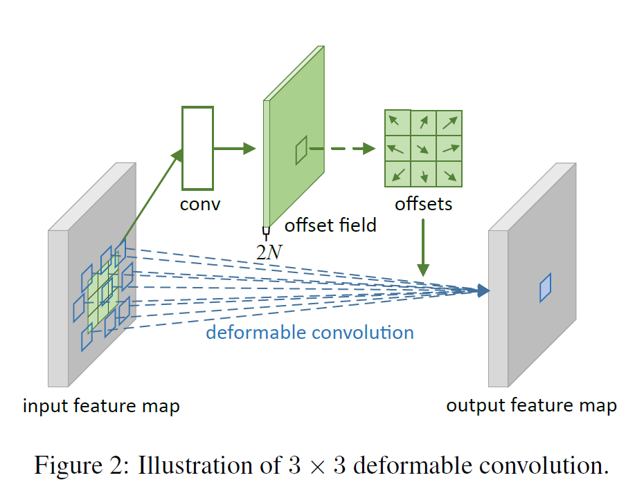

- deformable RoI pooling

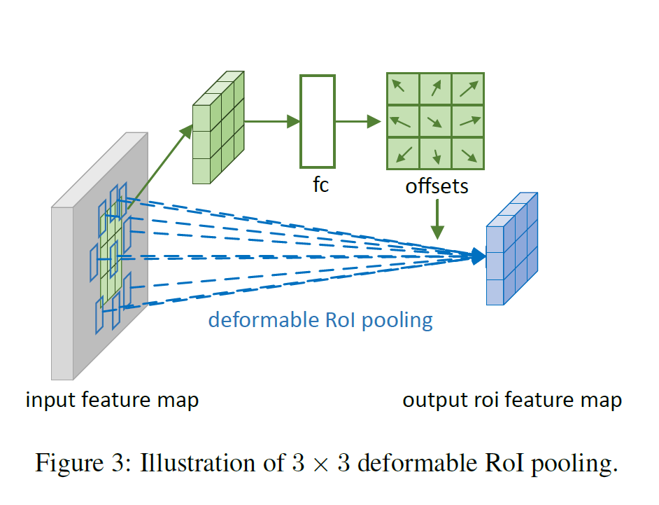

- deformable PS RoI pooling
  - PS: Position sensitive
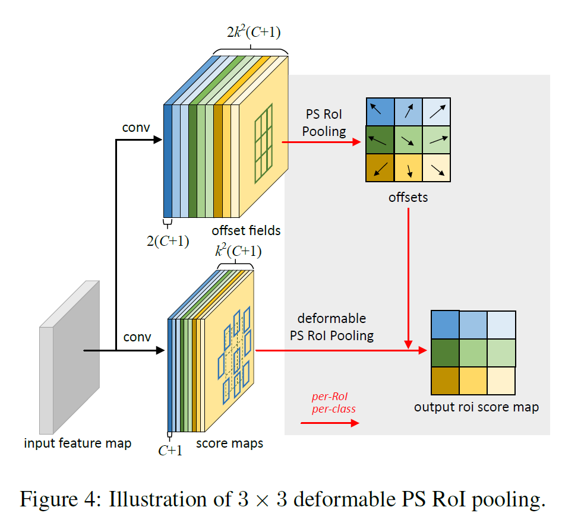

## 3.Rich feature hierarchies for accurate object detection and semantic segmentation
### Abstract
- RCNN
  - Regions with CNN features

### Introduction
- PASCAL VOC 2010
  - RCNN 53.7% vs Selective search for object recognition 35.1%
- ILSVRC2013
  - RCNN 31.4% vs OverFeat 24.3%
- Segmentation on PASCAL VOC 2010
  - 47.9%

### Methods
- System
  - 为不同类独立生成候选区域的模块
  - 大型卷积神经网络，为每个区域提取出定长特征
  - 一系列SVM分类器，个数等于类别个数

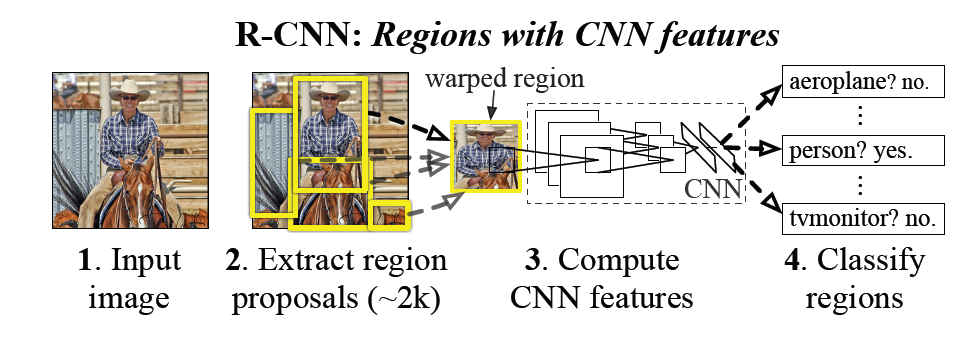

## 4.Spatial Pyramid Pooling in Deep Convolutional Networks for Visual Recognition
### Abstract
- 提出空间金字塔池化结构，使得网路的输入不一定需要固定大小的图像
- SPP-net 会为各种输入的图像都生成固定大小的特征向量
- 同时相对物体的变形具有稳定性
- 测试数据集： ImageNet 2012, Pascal VOC 2007, Caltech 101
- 检测任务的做法
  - 为整张图生成feature map，随机在feature map上截取region生成定长特征训练检测器
  - 在这一点上性能超过R-CNN
### Introduction
- 在最后一层卷积，全连接层之间插入SPP模块生成固定大小feature map

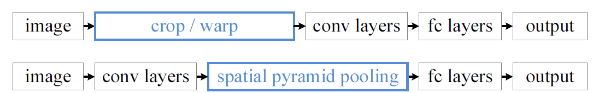

- SPP特点
  - 输出定长
  - 使用多级 spatial bins
  - 多尺度捕获特征
- SPP模块可以给已有网络涨点，尤其是深且大的网络

### Method
- 观察feature map，不固定图片大小，观察feature map中具有较大激活值的filter对应感受野
- SPP Layer
  - M 个spatial bins，这个M是固定的
  - 输出为 kM 维的特征向量
  - 最粗粒度的spatial bin可以执行全局平均池化操作，传统上来说，全局平均池化可以减少模型大小和防止过拟合
  - 假定输入图像是a * a, 某层spatial bin的个数是n * n，那么win = ceil(a / n), str = floor(a / n)

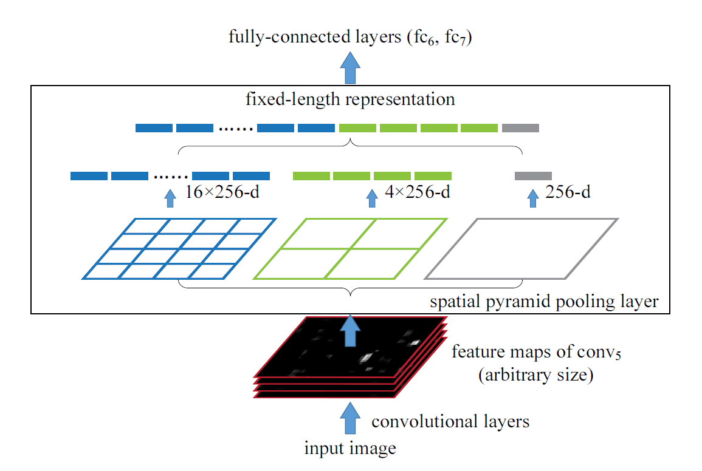

- 训练网络
  - 固定大小 224 * 224
  - 变化大小 224 * 224，180 * 180（resize得到）
    - 定义了两个网络，现在224 * 224上训练完整一个epoch，然后将参数复制到另一个网络训练一个180*180的epoch

### Experiments
- ImageNet 2012
  - 降低错误率（1.65%）
    - 增加了参数
    - 针对物体形变的稳定性
  - 多重size的图片输入可以涨点
  - 整张图片作为输入有奇效
  - 进一步探索
    - 在feature map中获取多个region后，输入fc层，将score做个平均值可以涨点
- VOC 2007
  - mAP指标
  - 达到state-of-art, 使用single-full-image representation 82.44%
- Caltech101
  - zhunquelv 93.42%
- Object detection
  - 思路
    - 使用selective search 生成候选区域
    - resize 到 min(w, h) = s
    - 生成feature map
    - 在feature map上截取候选区域输入到SPP中
    - 之后再额外训练SVM
      - ground-truth是正样例
      - IoU小于30%是负样例
        - 负样例之间不能重合超过0.7
  - 创新做法
    - 将图片resize到不同尺寸，在不同尺寸中得到一组region，然后观察哪个region最接近224 * 224，选取该region对应的feature map作为后续输入
  - dataset Pascal VOC 2007 score = 59.2
  - 模型融合
    - 仅仅使用不同的初始化就可以融合
    - 融合过程使用NMS算法(non-maximum suppression)，其思想是搜素局部最大值，抑制极大值
    - 效果出于卷积层，而非全连接层
    - 60.9
  - ILSVRC 2014
    - 35.11

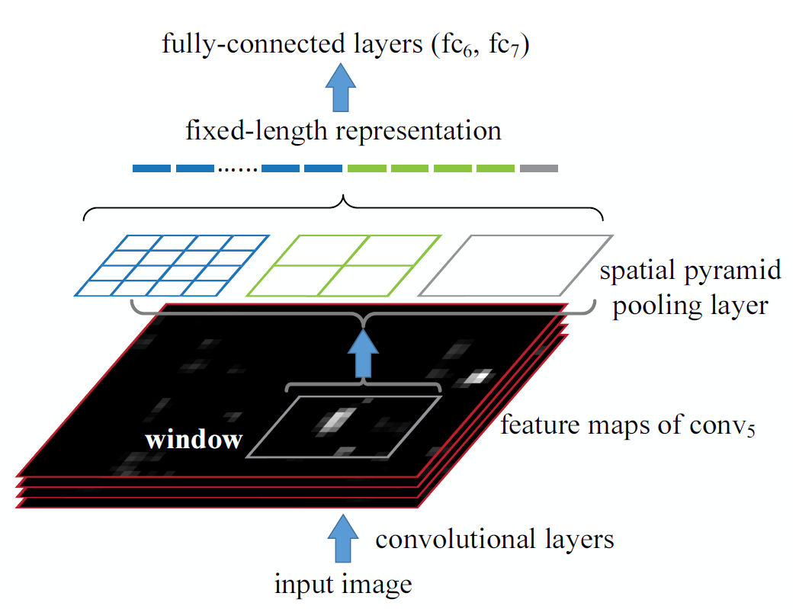

## 5.Fast R-CNN
### Abstract
- PASCAL VOC 2012 mAP = 66

### Introduction
- 挑战
  - 需要生成许多候选区域
  - 这些候选区域需要修整，以达到准确定位的要求
- 创新
  - single stage, 同时训练分类和定位

### Architecture and training
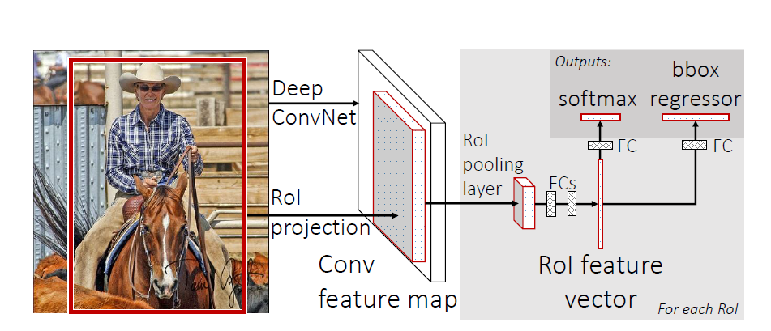

- RoI Pooling
- 网络结构调整
  - 最后一个池化层替换为RoI Pooling
  - 池化层之后的全连接层替换为两个分支，一支为softmax分类，另一支为多class的bbox regressor
  - 改变输入为图像和候选区域
- 相较于SPP 和 R-CNN的优势
  - SPP和R-CNN在反向传播时效率低下（当每次ROI的来源图像不一时）
  - fast R-CNN每次取N张图片，每张图片各取 R/N ROI区域序列训练
- Loss的设计

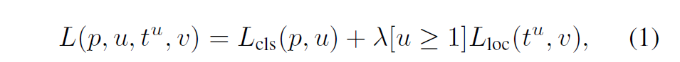

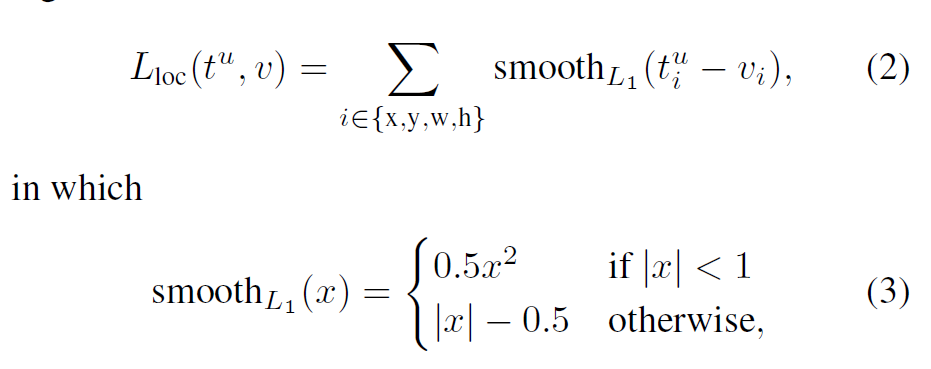

- 采样方式
  - 依照和ground truth box重合的IoU 划分
    - [0.5, 1] => u >= 1
    - [0.1, 0.5) => u = 0
    - [0, 0.1) => hard example
- 尺寸不变性
  - brute force, 训练和测试过程中统一改变图像大小
  - image pyramid, multi-scale的image组成pyramid,达到数据增强的效果

### Fast R-CNN detection
- 测试时会输入2000张候选区域，如果使用了image pyramid，则每个ROI找各个scale中最接近224*224的
- 使用SVD压缩全连接层，达到更快的速度

### Main Result
- State-of-art mAP on VOC2007, 2010 and 2012
- Fast
- Fine-tuing conv layers
- Set-up
  - S => AlexNet
  - M => VGG_CNN_M_1024 (just wider than S)
  - L => VGG16
- 结果
  - VOC 2007 => 68.1, 70.0 (外部数据)
  - VOC 2010 => 66.1, 68.8 (外部数据)
  - VOC 2012 => 65.7, 68.4 (外部数据)
- SVD的讨论
  - 加快测试速度
  - mAP降低0.3%
- Which layer to fine tune
  - 尝试了各个方法
  - 发现卷积层应该fine tune，但鉴于训练的时间代价，并不需要fine tune所有的卷积层

### 设计模式评估
- 数据集：PASCAL VOC2007
- 多任务的训练是否有效果
  - 多任务同时训练效果 > 分阶段训练分类和bounding box regression > 纯检测
- single scale or multi scale?
  - multi scale 虽然能涨点，与此同时付出更高的时间代价
- softmax or SVM?
  - 在fast rcnn中，softmax比svm好
- 更多的候选区域就更好吗？
  - 随着候选区域个数的增加 AR 和 mAP 不再重合
  - SS 方法
    - mAP会稍微增长后下降
  - densely generated box
    - mAP在区域个数在2K后开始下降，并且下降越来越快
- 在MS COCO上的结果
  - mAP 35.9%
