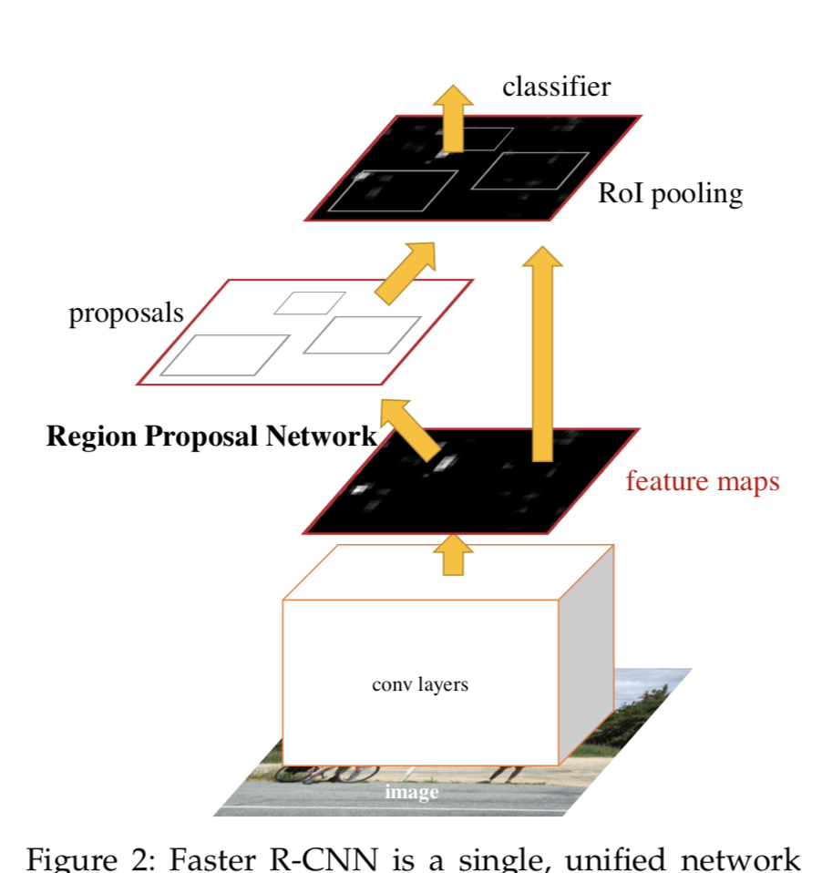
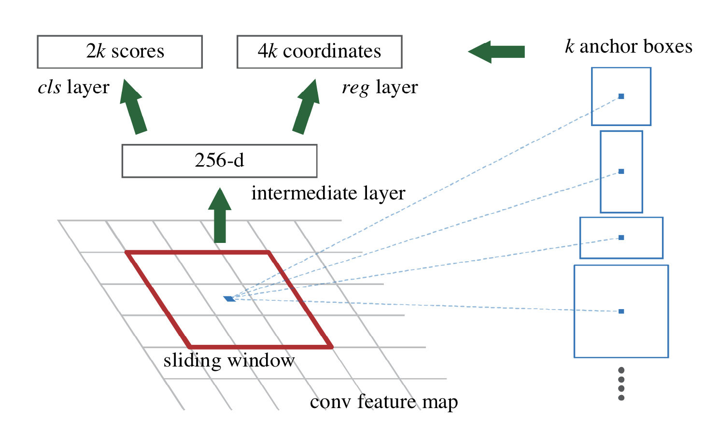
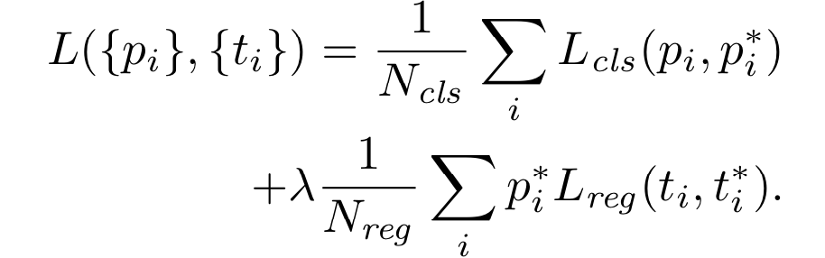
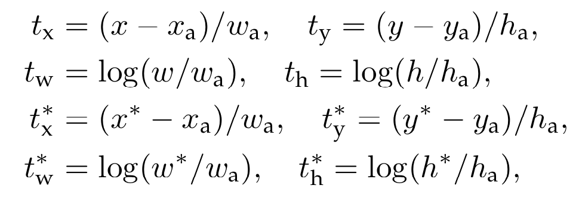

# 2019.8.17
## 1.Faster R-CNN: Towards Real-Time Object Detection with Region Proposal Networks
## Abstract
- 论文要点
    - 目标检测的速度瓶颈在于候选区域的选取
    - 该论文提出了RPN，更快获取重要候选区域
- 数据集
    - PASCAL VOC 2007 2012
    - MS COCO
## Introduction
- 为什么RPN能比Selective Search快
    - SS算法运行在CPU, 2 seconds per image
    - EdgeBoxes, 200 ms per image
    - RPN算法运行在GPU, 10 ms per image
- 兼容不同尺寸的主流方法
    - 1.Multiple scaled images
    - 2.Multiple filter sizes
    - 3.Multiple references(RPN)
## Faster R-CNN

### 1.RPN (Region Proposal Networks)

- 损失函数
    - 正标签给定
        - 最高IoU的anchor
        - IoU超过0.7的anchor
    - 负标签给定
        - 和所有GT box的IoU小于0.3
    - 实验的发现
        - 结果对lambda并不敏感
        - 两个分母其实可以省略
    - Bounding Box Regression不太一样
        - Fast R-CNN是直接在经过ROI的feature map上操作
        - 本文有k组不同的参数

- 训练方式
    - 从同一张图中尽可能获取同等数量的pos anchors和neg anchors

### 2.RPN和Fast R-CNN的训练方法
- 三种可能策略
    - Alternating training
        - 交替训练
    - Approximate joint training
        - 合并成一个网络训练
        - 但bound box regression要单独训练
    - Non-approximate joint training
        - 文中未细谈
- 本文采用四阶段的alternating training
    - 1.ImageNet-pre-trained初始化特征提取网络，fine tune RPN
    - 2.ImageNet-pre-trained初始化特征提取网络，使用1得到的RPN，fine tune Fast R-CNN
    - 3.使用2得到的特征提取网络，只优化RPN的unique layers
    - 4.只优化Fast R-CNN的unique layers

### 3.Implementation Details
- 输入图像按照长宽比resize，使得最小边长s=600
- anchors取法
    - area: 128 * 128, 256 * 256, 512 * 512
    - ratio: 1:1, 1:2, 2:1
- anchor越界问题
    - train: 丢
    - test: 裁
- RPN proposals交叠问题
    - NMS(non-maximum suppression)
    - 参照指标是输出的cls分数
    - IoU threshold是0.7
    - 最后按照cls分数取前N个
