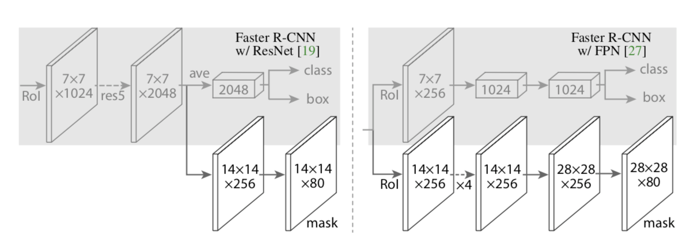

# 2019.8.17
## 1.Faster R-CNN: Towards Real-Time Object Detection with Region Proposal Networks
### Abstract
- 论文要点
    - 目标检测的速度瓶颈在于候选区域的选取
    - 该论文提出了RPN，更快获取重要候选区域
- 数据集
    - PASCAL VOC 2007 2012
    - MS COCO
### Introduction
- 为什么RPN能比Selective Search快
    - SS算法运行在CPU, 2 seconds per image
    - EdgeBoxes, 200 ms per image
    - RPN算法运行在GPU, 10 ms per image
- 兼容不同尺寸的主流方法
    - 1.Multiple scaled images
    - 2.Multiple filter sizes
    - 3.Multiple references(RPN)
### Faster R-CNN

#### 1.RPN (Region Proposal Networks)

- 损失函数
    - 正标签给定
        - 最高IoU的anchor
        - IoU超过0.7的anchor
    - 负标签给定
        - 和所有GT box的IoU小于0.3
    - 实验的发现
        - 结果对lambda并不敏感
        - 两个分母其实可以省略
    - Bounding Box Regression不太一样
        - Fast R-CNN是直接在经过ROI的feature map上操作
        - 本文有k组不同的参数

- 训练方式
    - 从同一张图中尽可能获取同等数量的pos anchors和neg anchors

#### 2.RPN和Fast R-CNN的训练方法
- 三种可能策略
    - Alternating training
        - 交替训练
    - Approximate joint training
        - 合并成一个网络训练
        - 但bound box regression要单独训练
    - Non-approximate joint training
        - 文中未细谈
- 本文采用四阶段的alternating training
    - 1.ImageNet-pre-trained初始化特征提取网络，fine tune RPN
    - 2.ImageNet-pre-trained初始化特征提取网络，使用1得到的RPN，fine tune Fast R-CNN
    - 3.使用2得到的特征提取网络，只优化RPN的unique layers
    - 4.只优化Fast R-CNN的unique layers

#### 3.Implementation Details
- 输入图像按照长宽比resize，使得最小边长s=600
- anchors取法
    - area: 128 * 128, 256 * 256, 512 * 512
    - ratio: 1:1, 1:2, 2:1
- anchor越界问题
    - train: 丢
    - test: 裁
- RPN proposals交叠问题
    - NMS(non-maximum suppression)
    - 参照指标是输出的cls分数
    - IoU threshold是0.7
    - 最后按照cls分数取前N个

## Mask R-CNN
### Abstract
- 目标检测+实例分割
- 容易训练
- 可以泛化到其他任务比如人体关键点检测
- 数据集：COCO 2016 challenge

### Introduction
- Mask R-CNN并不能保证输入输出一一对其（RoIPool的存在），因此引入了RoIAlign层
- decouple 分割和分类流程，每一个类别的分割都单独进行，最后按照分类结果选取分割结果

### Mask R-CNN
- 1.Faster R-CNN
- 2.Mask R-CNN
    - 以RoI为输入
    - 输出的size为 K m**2
    - 只有对应class的mask prediction会做loss（sigmoid + BCELoss） 
- 3.Mask Representation
    - 在RoI上用FCN预测mask
- 4.RoIAlign
    - 计算坐标时不取整
    - 使用双线性插值
- 5.Network Architecture

- 实现细节
    - mask的loss仅仅作用与标签为正的RoI
    - mask label是ground-truth mask和RoI的交集
    - 短边是800
    - 正负RoI比例为1:3
    - infer时只对最高置信度的100个region做分割

### Experiments
- 数据集
    - COCO
    - 取80k张训练图片和35k张验证图片做训练
    - 剩余5k张验证图片做验证
- 消融实验
    - Backbone architecture
        - 深网络
        - FPN
        - ResNext
    - Multinomial vs. Independent Masks
        - 应该解耦分类和分割
    - RoIAlign
- Mask R-CNN在两个更新上提高了检测的效果
    - RoIAlign
    - 增加了mask预测分支

### For Human Pose Estimation
- 可以增加检测和mask分割分支来长点
- 但是pose estimation分支不能给以上任务长点

### 实现的一些trick
- 1.Updated baseline
    - 学习率在120k迭代和160k迭代时除以10
    - 增大NMS的threshold（从0.3到0.5）
- 2.End-to-end training
    - 使用Faster R-CNN提到的approximate模式训练
- 3.ImageNet-5k pre-training
    - 5k指的是5k classes
- 4.Train-time augmentation
    - randomly sample a scale from [640, 800]
    - 增大迭代次数
    - 延长lr渐变周期
- 5.Model architecture
    - ResNeXt 101 to ResNeXt 152
    - NL
- 6.Test-time augmentation
    - 多项共同预测
        - scale <= {400, 500 ... 1200}
        - 水平翻转
- 7.Data distillation
    - self-training