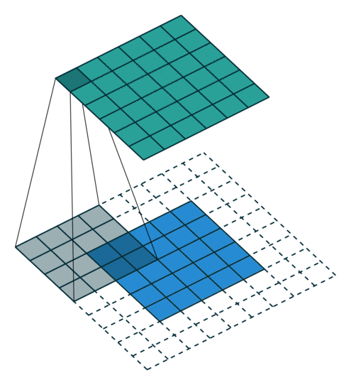
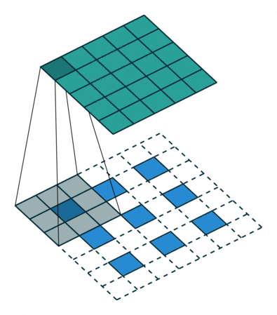
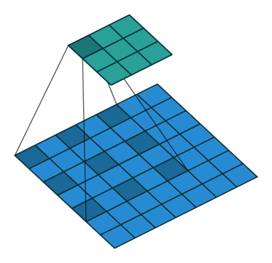
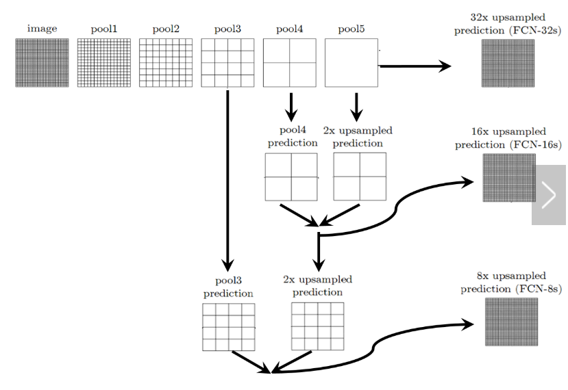
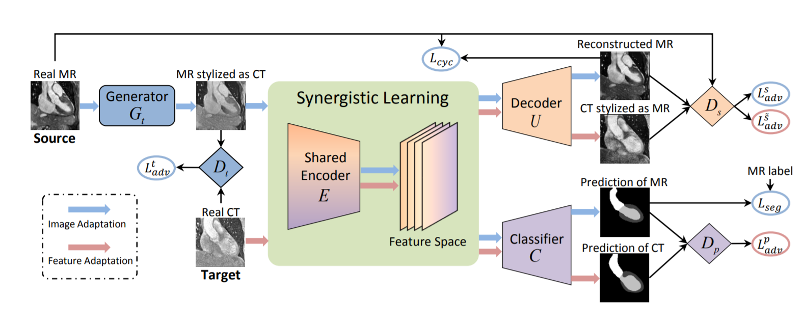
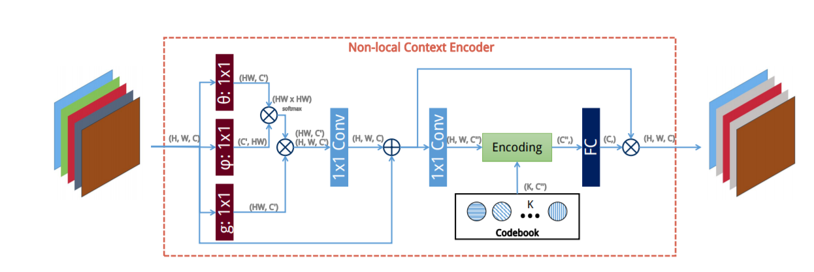
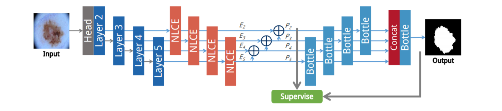
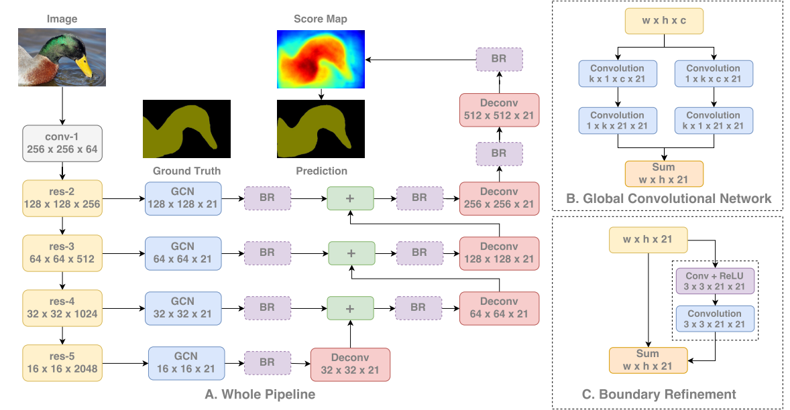

# 2019.8.3
## 1.卷积、反卷积和扩张卷积

 
 
 
 
 
 
 
 
 
 
- 卷积过程边长计算公式
  - o = (i - k + 2p) / s + 1
  - i = s(o - 1) - 2p + k
- 扩张卷积的kernel计算公式
  - k_new = k + (k - 1)(r - 1)

## 2.FCN
将分类网络的FC层替换为卷积层

可以学习的反卷积层

跳级(skip)结构，将不同池化层的结果进行上采样后来优化输出。

## 3.DeepLab: Semanic Image Segmentation with Deep Convolutional Nets, Atrous Convolution and Fully Connected CRFs
提出了扩张卷积，有两种实现方式：
- 卷积核中隐式掺入0，或者从输入中稀疏采样
- 生成r*r个稀疏采样输入，之后使用平凡卷积操作即可
 
提出了atrous空间金字塔池化结构
- 原先的方法是生成多个不同尺寸的feature map，双线性插值至原图大小后做池化
- 类似扩张卷积，提出“扩张池化”，进而控制不同的rate不断加入到输出中

使用全连接的CRF对预测结果平滑化处理

## 4.Synergistic Image and Feature Adaptation

## 5.Non-Local Context Encoder: Robust Biomedical Image Segmentation against Adversarial Attacks

两个要点：global spatial dependencies & global contextual information

第一个是点与点（像素）之间的联系，第二个是面（整体图像）的普遍特征

提出了NLCE，一个模块
- 提取或远或近的空间关联信息

提出了NLCN，一个网络
- 使用NLCE加强提取的特征，进而融合多尺度特征产生结果

## 6.Large Kernel Matters ---- Improve Semantic Segmentation by Global Convolutional Network

提出了GCN模块和BR模块
- GCN相同于使用了k*k大小的卷积核，但复杂度明显降低
- GCN中间不会使用非线性函数

对于分类来说，要求模型对各种变换具有不变性；而对于定位，则要求模型对变换具有高度敏感性。
- 第一，从定位的角度出发，应该采用全卷积的结构，去掉全连接层或全局池化层；
- 第二，从分类的角度出发，应该采用较大的卷积核，使得像素与特征图的结合更加紧密，增强处理不同变换的能力，而且，一旦卷积核过小，造成感受野过小，覆盖不了较大的目标，不利于分类。

FCN是该网络的分割框架

