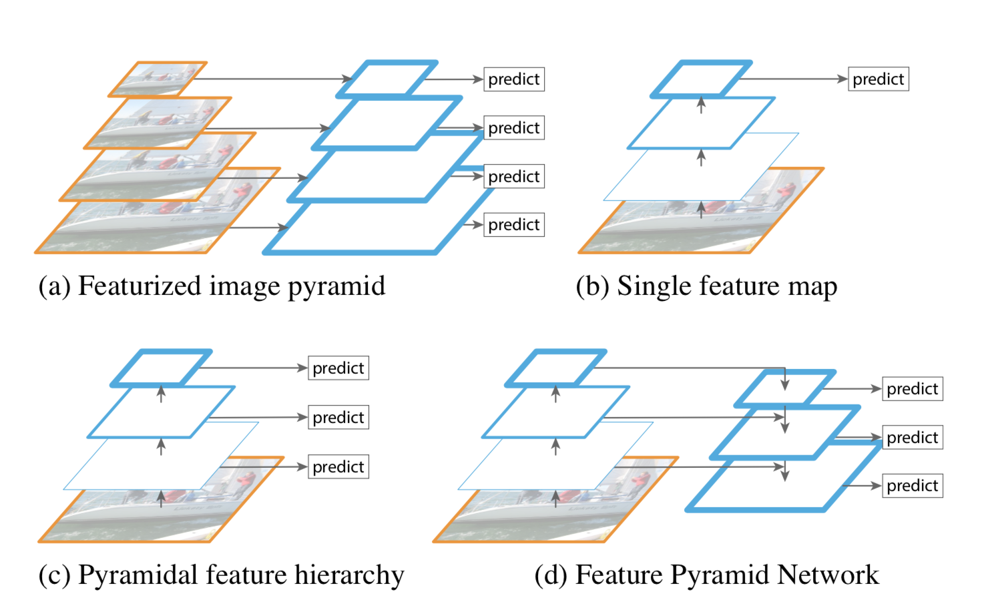
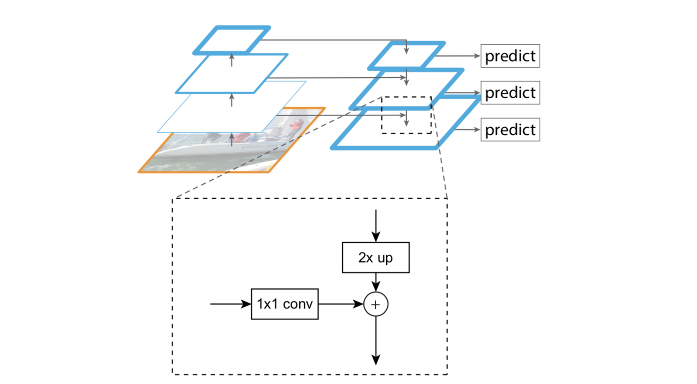

# 2019.8.31
## 1.Feature Pyramid Networks for Object Detection
### Abstract
- FPN实现：自底向上获取图片各层次的features后，再加上一个自顶向下的过程，并且包含横向残差的计算过程
- 比赛：COCO2016

### Introduction
- 关于多层特征
    - 优点
        - 获取多尺度特征，各个级别都有丰富的语义特征
    - 缺点
        - 开销大
        - 占用内存多
- 各种金字塔结构
    - (a) Featurized image pyramid 计算与内存开销太大
    - (b) Single feature map 框不出小物体
    - (c) Pyramidal feature hierarchy 底层大scale的feature map语义信息少，虽然框出了小物体，但小物体容易被错分

### Feature Pyramid Networks
- 应用领域
    - RPN
    - Fast R-CNN
    - Segmentation
- 构建元素
    - 自底向上的流程
        - 以resnet为backbone
        - 获取四个残差块的输出
        - 输出为{C2, C3, C4, C5}
    - 自顶向下的流程
        - 上采样中：fastor=2，最近邻方式
        - 残差之后要加一层conv3*3，以减少上采样带来的对齐影响
        - **所有的尺度都共享后续网络中的参数**
        - 输出为{P2, P3, P4, P5, *P6*}
    - 横向连接（残差）

### Application
- 针对RPN的调整
    - anchor只需要一个scale就够
    - 在FPN中增加一个P6输出是为了扩展到512 * 512的anchor
    - 所有level的参数都共享
        - 不共享的准确率差不多
        - 这个结果也说明了其实金字塔的每级level都有差不多相似的语义信息，而不是普通网络那样语义信息区别很大。
- 针对Fast R-CNN的调整
    - 共享参数
    - 不同层次的特征图上包含的物体大小也不同，因此，不同尺度的ROI，使用不同特征层作为ROI pooling层的输入。大尺度ROI就用后面一些的金字塔层，比如P5；小尺度ROI就用前面一点的特征层，比如P4。