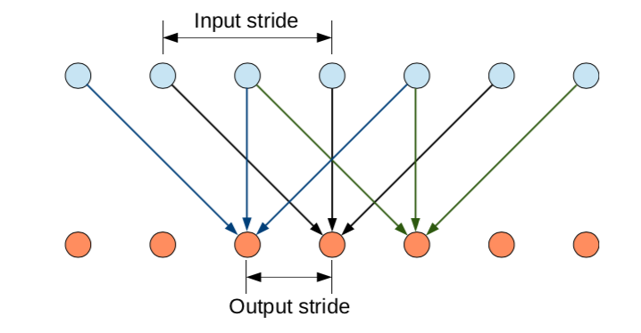
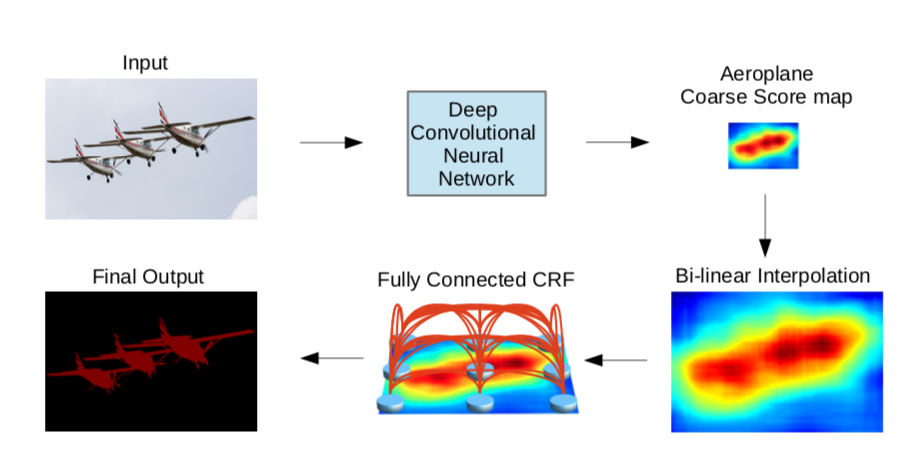
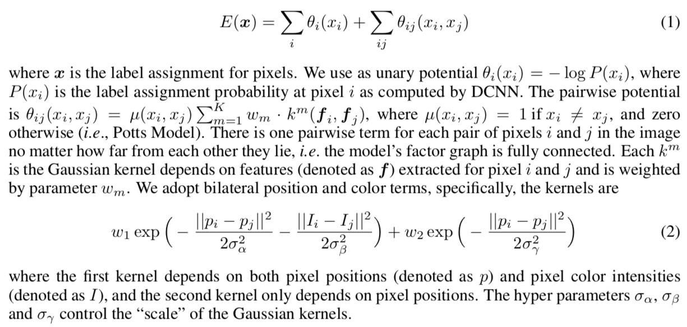
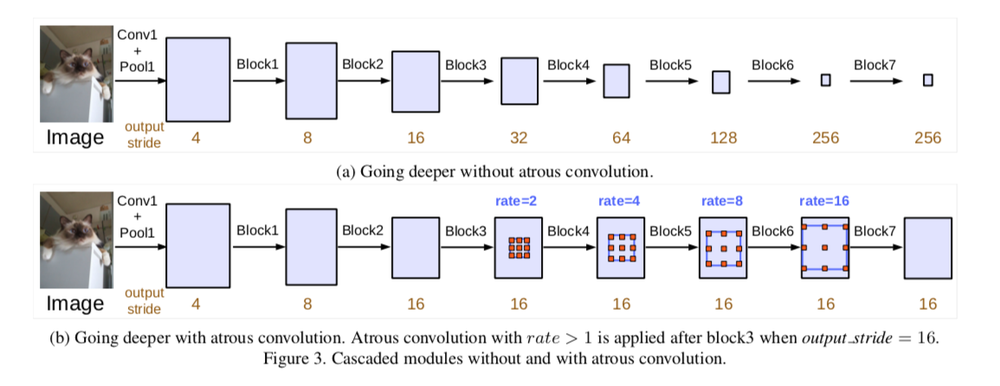
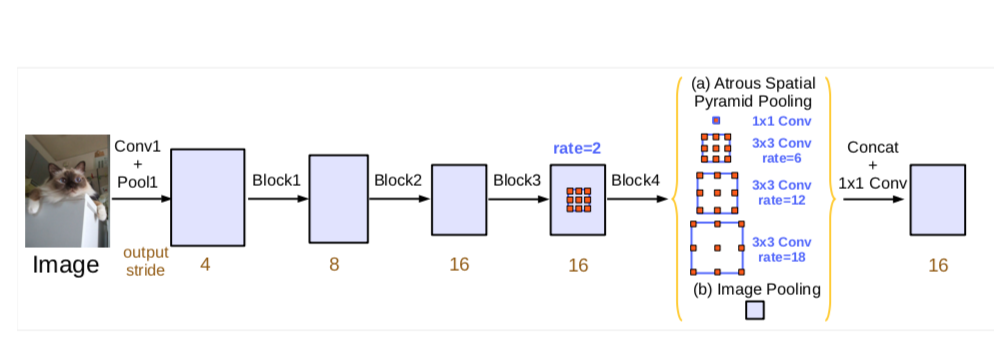

# 2019.9.21
## U-Net: Convolutional Networks for Biomedical Image Segmentation
### 网络结构

### Tricks
- 输入的图像在size上略有扩展（镜像方式）
- 为了表现更好的多细胞分割，训练时适当增加细胞边界背景的权重
- 数据增强
    - 平移
    - 旋转
    - 仿射变换
    - 灰度变换
    - 随机弹性形变
    - 网络中的dropout

### Dataset
- ISBI challenge

## Semantic Images Segmentation with Deep Convolutional Nets and Fully Connceted CRFs
### Abstract
- 使用CRF处理DCNN的输出，使得分割结果具备更加准确的局部边界
- PASCAL VOC-2012 IOU 71.6%

### Convolutional Neural Networks for Dense Image Labeling
- Efficient dense sliding window feature extraction with the hole algorithm
    - 将网络转换成全卷积模式
    - 空洞卷积
    - 只降采样到原图的1/8，然后双线性插值至原图大小

    

- Controlling the receptive field size and accelerating dense computation with convolutional nets
    - 减少第一个卷积的卷积核（从7x7 到 3x3）

### Detailed Boundary Recovery: Fully-Connected Conditional Random Fields and Multi-Scale Prediction
- Deep convolutional networks and the localiztion challenge
    - 分类准确率和分割精确性的权衡问题
    - 卷积网络只能给出大概的分割结果，但是并不能得出精细的分割边界
- Fully-connected conditional random fields for accurate localization

## Rethinking Atrous Convolution for Semantic Image Segmentation
### Abstract
- 使用空洞卷积
- 改进了空洞空间金字塔池化模块
- 舍弃了CRF
- 数据集依然是PASCAL VOC 2012

### Method
- Atrous Convolution for Dense Feature Extraction
    - 灵活控制卷积核的感受野大小
- Going Deeper with Atrous Convolution
    - 连续的降采样不利于分割
    - 本文采用 Multi-grid 方法，在后续卷积模块中引入空洞卷积

- Atrous Spatial Pyramid Pooling
    - 和先前DeepLab不同的是，这次引入了BN层
    - 随着rate的增大，有效卷积核个数逐渐减少，最后缩减为1个（中心）
    - 网络结构如下（如果stirde是8，则pooling当中的rate都要乘2）

